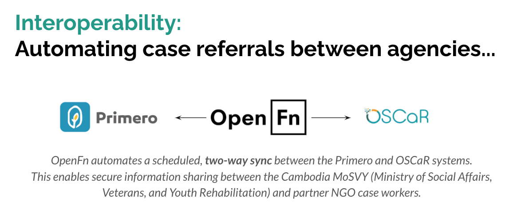
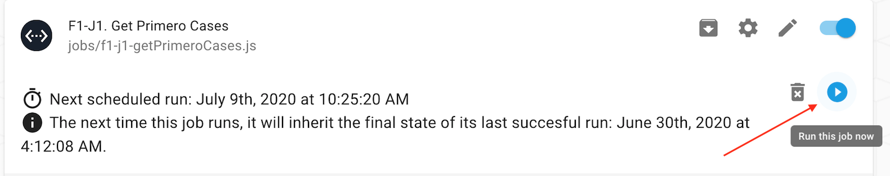

# IO Solution between Primero and OSCaR Systems
Automated information exchange between the Primero and OSCaR systems has been implemented on OpenFn to enable interoperability between MoSVY (Primero users) and NGO case workers (OSCaR users) in Cambodia. This OpenFn solution was implemented in partnership with UNICEF Cambodia. 


## (1) Interoperability Solution Overview
See [this project background](https://docs.google.com/document/d/1zNyWXHhbJ0u_v5oeFSRGGoam2KdwHEYgSuSJ33qFai8/edit#heading=h.rmgmdzhp7hd5) for an overview of the Primero & OSCaR interoperability project and requirements. **See the user guides** for step-by-step instructions for MoSVY and NGO case workers. 
- [English user guide](https://docs.google.com/document/d/1c2irTpsZaOIEGzQaP1_O6XaREobJPdxV914hoDPJ9Dg/edit?usp=sharing) 
- [Khmer user guide](https://drive.google.com/file/d/1k3H5ZHgFOQDsA5yQVWSf_5rflH-5lEx5/view?usp=sharing)

Two interoperability workflows have been implemented to facilitate a bi-directional sync between the Primero and OSCaR systems to share relevant case and referral data between systems. This is to support the following functional requirements.

_**Flow 1: Primero cases --> OSCaR**_
* Sending MoSVY government referrals to NGO case workers

_**Flow 2: OSCaR cases --> Primero**_
* Sending NGO referrals to MoSVY case workers
* Syncing NGO cases to Primero for MoSVY case workers to view (to prevent duplicate work)

### Videos
[See this video playlist](https://www.youtube.com/playlist?list=PLSnTMDfTYBLj0cLKYgYBAtLU0lyrSG7Zb) for the solution overview & demo of the interoperability workflows. 

## (2) Integration with System APIs
To automate the IO workflows, a bi-directional integration has been configured on the [OpenFn](openfn.org) platform to connect the Primero and OSCaR APIs. 

**APIs*** implemented:
* Primero: [API v1.1](https://docs.google.com/document/d/1jpaT2_UBBnc3PxPYlLMBEzNUkyfuxRZiksywG5MKM0Q/edit?usp=sharing) 
* OSCaR: [API v1.0.0](https://app.swaggerhub.com/apis/Ro51/OSCaRInterop/1.0.0#/info)

_*Note that these APIs are newly implemented and were developed at the start of this integration implementation._

**OpenFn Adaptors** (API wrappers) implemented: 
* [language-primero](https://github.com/OpenFn/language-primero) - This adaptor is version-locked on OpenFn.org as Cambodia has implemented `Primero v1.7` (and has not yet upgraded to `Primero v2`). 

## (3) Interoperability Workflows
To achieve a bi-directional systems sync, 4 OpenFn jobs have been implemented to automate the IO workflows

_**Flow 1: Primero cases --> OSCaR**_ ([Data flow diagram](https://lucid.app/lucidchart/invitations/accept/f6751d0f-2e48-4978-a635-13b8a45d6b3e))
1. [f1-j1-getPrimeroCases.js](https://github.com/OpenFn/unicef-cambodia/blob/master/jobs/f1-j1-getPrimeroCases.js) will fetch Primero case updates & referrals
2. [f1-j2-casesToOscar.js](https://github.com/OpenFn/unicef-cambodia/blob/master/jobs/f1-j2-casesToOscar.js) will upload Primero data to OScaR

_**Flow 2: OSCaR cases --> Primero**_ ([Data flow diagram](https://lucid.app/lucidchart/invitations/accept/43b99cf0-7801-4ecc-882d-d404c0369a12))
1. [f2-j1-getOscarCases.js](https://github.com/OpenFn/unicef-cambodia/blob/master/jobs/f2-j1-getOscarCases.js) will fetch OSCaR case updates & referrals
2. [f2-j2-upsertCasesToPrimero.js](https://github.com/OpenFn/unicef-cambodia/blob/master/jobs/f2-j2-upsertCasesToPrimero.js) will upload OSCaR data to Primero


## (4) Automation Triggers
### Trigger Type: Cron Timer

Every hour at `00` minutes (cron: `00 * * * *`) OpenFn will run the 4 jobs to fetch new case information from the Primero and OSCaR systems. The flows may also be executed on-demand at any time by a designated OpenFn admin user by clicking the "Run" button on a job in OpenFn.org. 


_**Flow 1: Primero cases --> OSCaR**_

<!--`GET ... ` -->
`f1-j1-getPrimeroCases.js` sends a GET request to Primero to list cases where: 
1. New referrals have been created (indicated by Primero _date_ field `transitions_created_at`).
2. Case updates made since the last OpenFn request, indicated by Primero _date/time_field `transitions_changed_at`. (Note: This happens if the case owner, case owner’s phone, case owner’s Agency, or the Service Implemented On fields are changed.) 

Example Request:
``` 
GET /api/cases?remote=true&scope[or][transitions_created_at]=or_op||date_range||07-05-2020.01-01-4020&scope[or][transitions_changed_at]=or_op||date_range||07-05-2020 00:40.01-01-4020 03:00&scope[service_response_types]=list||referral_to_oscar 
```

_**Flow 2: OSCaR cases --> Primero**_

`f2-j1-getOscarCases.js` sends a GET request to OSCaR to list cases where: 
<!--`GET ... ` -->
1. New external referrals have been created (indicated by OSCaR field `referred_external`). 
2. Case updates made since the last OpenFn request(indicated by OSCaR _date/time_ field `since_date`). 

Example Request:
```
 GET /api/v1/organizations/clients?since_date='2020-07-01 01:00:00'&referred_external=true
```
## (5) Data Sharing Protocols & Mappings
### Data Sharing Agreements
[See this folder](https://drive.google.com/drive/folders/1Wb_h0Dazt8socWRW7buR2IBNqW4Pft7_?usp=sharing) for copies of the data sharing agreements between the MoSVY and Cambodia (OSCaR user) agencies. 

[See this mapping table](https://docs.google.com/spreadsheets/d/1x-KUJgOhaZlZYzJ935q9QXhPM0yobjEEuN-IJgIvmwA/edit?usp=sharing) for the data element mappings implemented in the IO solution. This includes detailed integration mappings for **Services** and **Primero Users/Case Owners**. 

### Data Entry Protocols
In order for data to be successfully exchanged as expected, users should follow the data entry protocols defined in the training sessions. For an overview of the data entry steps in both the OSCaR and Primero systems (see the below videos). If these data entry steps are _not_ followed and consent is _not_ provided in the Primero system, then these cases may not be eligble for case sharing and referrals between systems. **See the videos (above) for guidance**. 

## (6) Solution Assumptions 
#### 1. Unique Identifiers
OpenFn will perform `upsert()` (update if record exists, create if new) operations in both the Primero and OSCaR systems when syncing data. To ensure no duplicate cases are entered, OpenFn will use the below identifiers to check for existing cases. _We assume that these identifiers are unique_. 
   - OSCaR unique id: `global_id` (represented as `oscar_number` in Primero system)
   - Primero unique id: `case_id` (represented as `external_id` in OSCaR system)

#### 2. Referral Services 
Service types are mapped between systems as defined in the [Service Map](https://docs.google.com/spreadsheets/d/1x-KUJgOhaZlZYzJ935q9QXhPM0yobjEEuN-IJgIvmwA/edit#gid=1841308930). _If any services change, this map and OpenFn jobs must be updated._

#### 3. Primero Case Owner Assignment**
When cases are synced with Primero, they will be automatically assigned to a Province user case owner by OpenFn (see `owned_by` field in mappings). The Province will be determined by the location code of the child provided by OSCaR. See [Province User Map] for the list of generic Primero Province users. 

#### 4. Organization/ Agency names
Agency IDs and Names are mapped between systems assuming specific naming conventions (see below). Any new organizations/agencies should be registered following the same naming conventions, otherwise the OpenFn jobs may need to be updated.  
    - Oscar Organization Name: `'{organization_name}'` (e.g., `cif`)
    - Primero Agency ID: `'agency-{organization_name}'` (e.g., `agency-cif`)

## (7) Change Management (Considerations for Admins)
System administrators are responsible for identifying if changes may impact the OpenFn integration. 
1. If login credentials are changed for either system, the relevant **Credential** must be updated in OpenFn.org. 
2. If system changes are made to any of the **fields** referenced in the [field mappings](https://docs.google.com/spreadsheets/d/1x-KUJgOhaZlZYzJ935q9QXhPM0yobjEEuN-IJgIvmwA/edit?usp=sharing), the OpenFn jobs should be reviewed and tested to confirm no impact on the integration. 
3. If the list of available **Agencies** or **Services** in either system changes, then the Administrator should review the [mapping document](https://docs.google.com/spreadsheets/d/1x-KUJgOhaZlZYzJ935q9QXhPM0yobjEEuN-IJgIvmwA/edit?usp=sharing) to confirm no updates are required in the OpenFn Interoperability automation. 
4. If **new Agencies/ Organizations are created** in either system, OSCaR and Primero teams will coordinate to manually register the new agencies in each system (this is _not_ an automated process). Primero administrators will need to (1) add the new agency to the list of `Implementing Agencies` and create a new generic agency user (e.g., `agency-cif-user`). 
_Agency/Organization Ids should follow the below naming conventions, otherwise the OpenFn mappings may need to be updated_: 
    - Oscar Organization Name: `'{organization_name}'` (e.g., `cif`)
    - Primero Agency ID: `'agency-{organization_name}'` (e.g., `agency-cif`)

## (8) Administration
### Provisioning, Hosting, & Maintenance
This integration is hosted on [OpenFn.org](https://openfn.org/projects) with Primero SaaS. OpenFn will provide ongoing maintenance support to the MoSVY administrators managing OpenFn and Primero.  

### Support 
Contact **support@openfn.org** with any questions or troubleshooting support. 

**MoSVY Primero system administrators will be the primary contacts** responsible for ongoing integration monitoring and management: 
srychandina@gmail.com
sovansideth@gmail.com 

#### Other Support Contacts
**UNICEF:**
mkeng@unicef.org 		
pkhauv@unicef.org 

**OSCaR:**
sokly@childreninfamilies.org
kiry@devzep.com

### Training Materials
- Administrators: [See the video recording](https://youtu.be/-5-Y9ZrK-aQ) and [presentation](https://docs.google.com/presentation/d/1aUprT1CwnEWtIax_PGxsPspXdR3mPy78rj6qt92dxeI/edit?usp=sharing) from the December 2020 System Administrators training. This includes an overview of integration monitoring, error codes, and troubleshooting. 
- Case Workers: [See the training recording](https://youtu.be/9kSiY3Ld2bE) and the [IO User Guide](https://docs.google.com/document/d/1c2irTpsZaOIEGzQaP1_O6XaREobJPdxV914hoDPJ9Dg/edit?usp=sharing). 
